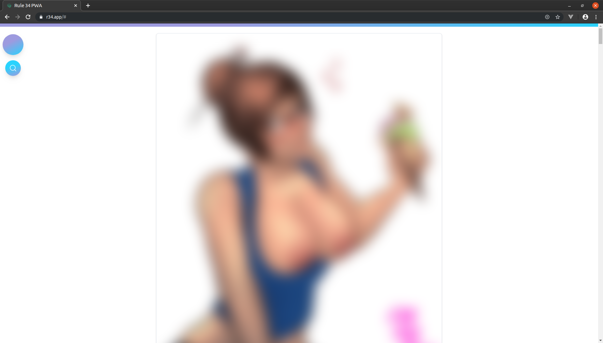
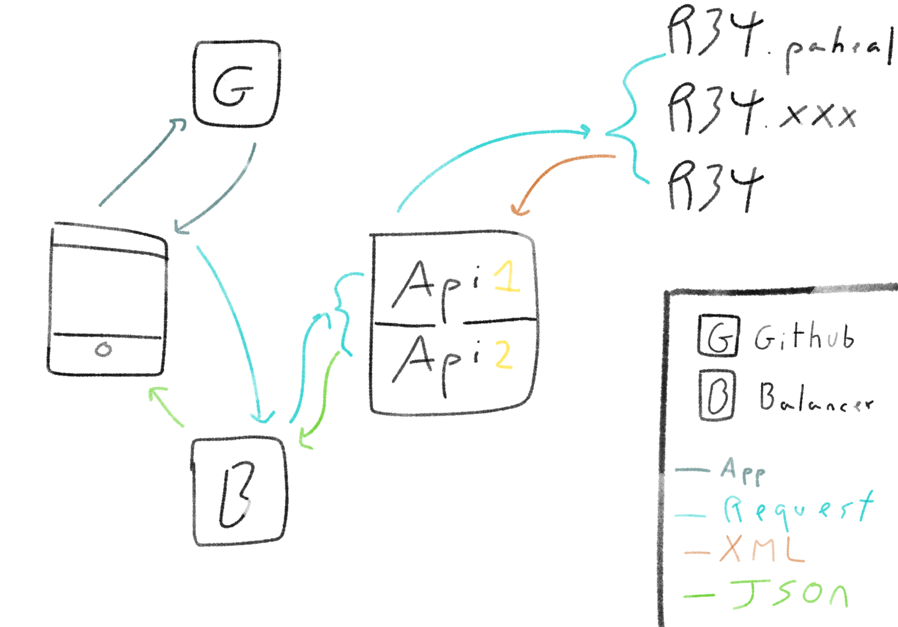

# Rule 34 App (PWA)

Browse the most popular boorus in the Rule 34 App

## Visit it

[https://r34.app/](https://r34.app/)

> Powered by Netlify

[](https://app.netlify.com/sites/rule34-pwa/deploys)

## Preview




## Social

### Discord

Join the **[community discord](https://discord.gg/fUhYHSZ)** for updates on the project!


### Twitter

You can also follow the **[Rule 34 App Twitter](https://twitter.com/Rule34App)** for day to day tips on how to use the App!

# API

This App uses a JSON wrapper for various Rule 34 XML APIs, it is developed and mantained by me, and can be found [here](https://github.com/VoidlessSeven7/Rule-34-API).

## Future

Since the API is being hosted on heroku's free tier, It wont hold lots of connections at the same time, specially when serving videos from Rule 34 APIs, So I've planned and developed a solution:



If I duplicate the API and use a Load Balancer, a lot of stress would be removed and it would continue to work fine, but I have the following problems:

**Monetary problem**, I don't have the funds to pay for the duplicated API, or the Load Balancer.
Since this is a **free** service that I'm offering, with **no ads** to generate revenue, I ask of you, **if you really like my work**, please donate whatever amount you can to the future of this app.

[Patreon](https://patreon.com/VoidlessSeven7) | [Paypal](https://www.paypal.me/Alejandrorr7)

## Technologies used

#### Languages

HTML, CSS, Javascript, NodeJS, NPM

#### Technologies

NuxtJS, VueJS, TailwindCSS, Webpack, etc.

You should read the [package.json](package.json) file for the full list.

## VSCode extensions used

ESLint, Prettier, Vetur

###### Recommended extensions for developing

> File utils

## Build Setup

```bash
# install dependencies
$ npm install

# serve with hot reload at localhost:3000
$ npm run dev

# generate static project
$ npm run generate
```

For detailed explanation on how things work, check out [Nuxt.js docs](https://nuxtjs.org).
